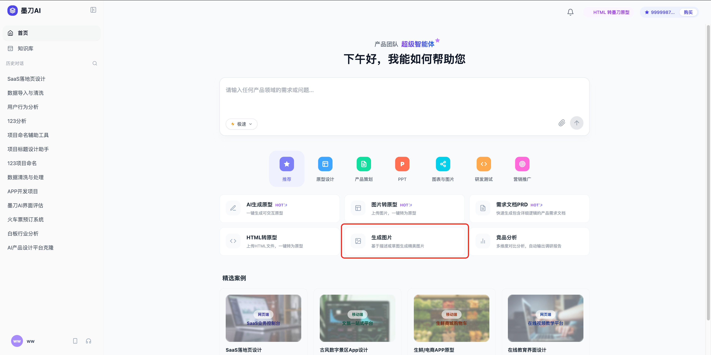
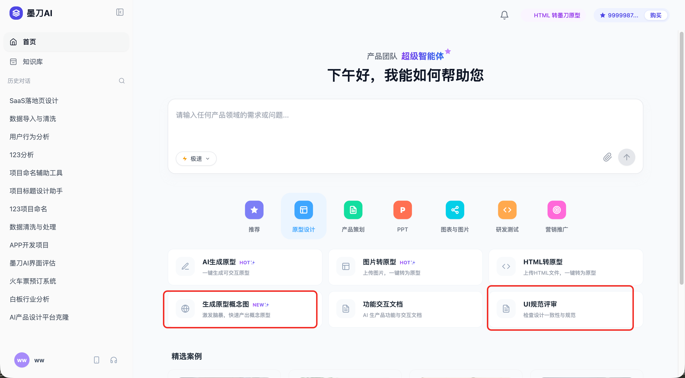
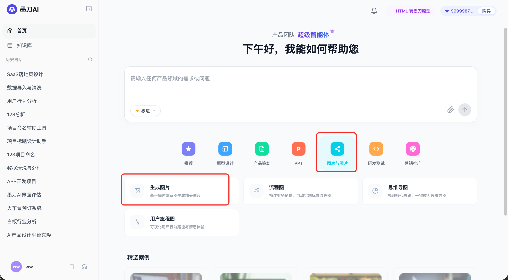
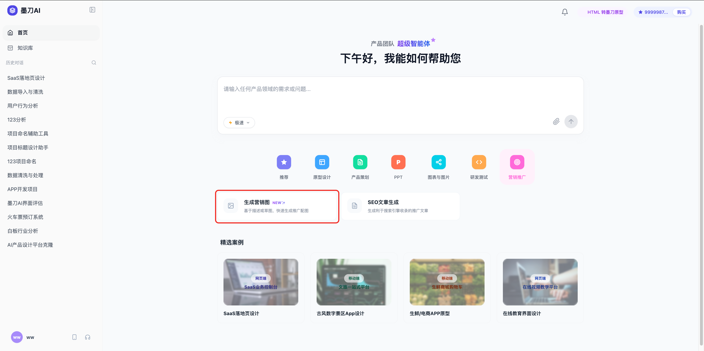

### 1、首页信息架构
  - **首页**
      - 推荐
        - AI生成原型
        - 图片转原型
        - 需求文档PRD
        - HTML转原型
        - 生成图片
        - 竞品分析
      - 原型设计
        - AI生成原型
        - 图片转原型
        - HTML转原型
        - 生成原型概念图
        - 功能交互文档
        - UI规范评审
      - 产品策划
        - 需求文档PRD
        - 竞品分析
        - 用户调研
        - 产品方案评审
        - 产品规划
      - PPT
        - AI生成PPT
        - AI美化PPT
      - 图表与图片
        - 生成图片
        - 流程图
        - 思维导图
        - 用户旅程图
      - 研发测试
        - 测试用例生成
        - 技术方案生成
        - 技术方案评估
      - 营销推广
        - 生成营销图
        - SEO文章生成

调整区域
- 推荐tab下增加生成图片
  
- UI规范评审移到原型设计tab下，去除UI设计一级tab
- 原型设计tab下增加生成原型概念图
  
- 图表改为图表与图片，增加生成图片选项
  
- 营销推广tab下增加生成营销图
  